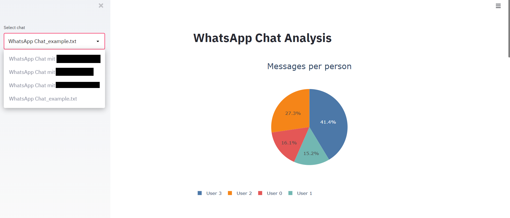
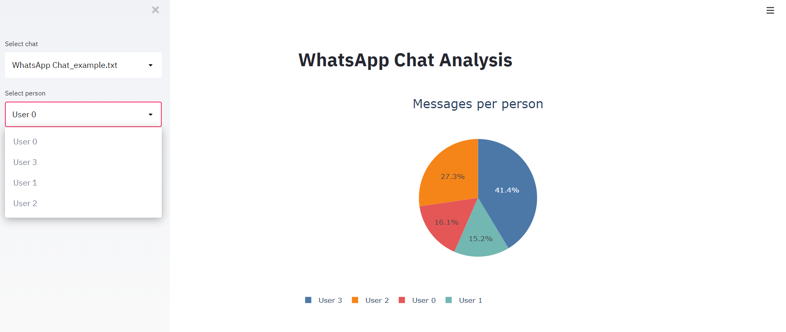
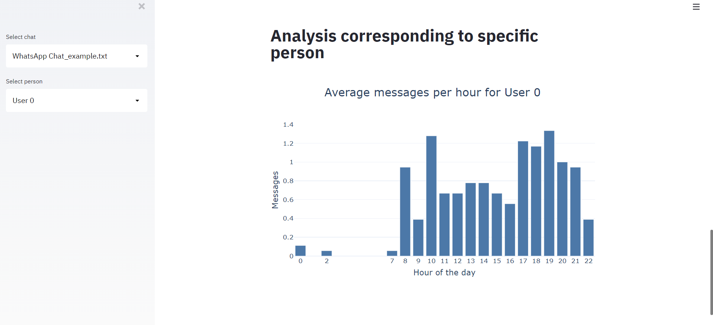

# whatsapp-analytics
 Analyze your whatsapp chats with python and plot fancy plots about you chat statistics. Access all the plots with [streamlit](https://www.streamlit.io/) in your browser.

## Setup

Install all the required packages with
````
pip install -r requirements.txt
````
## Extract WhatsApp chats


The text file has (beyond some special lines for media etc.) the following syntax:
```
DD.MM.YY, hh:mm - SENDER: MESSAGE
```
The file will first get cleaned and then stored in a Pandas dataframe.

## Usage
At first, you need to change the folder for the chat(.txt) files in ````whatsapp-analytics-streamlit-plotly.py````. That's because streamlit does not provide a proper functionality to import files from file explorer.

Use [streamlit](https://www.streamlit.io/) in your browser to access plots:
```
streamlit run whatsapp-analytics-streamlit-plotly.py
```

## Examples
There are not all plots available in streamlit. If you want to see all plots refer to ```whatsapp-analytics.ipynb```.

Other examples can be seen here:

At first, select the chat file you want to analyze:


For some plots, a spcific user has to be chosen:


See a user specific plot:


## To-Do
- Include all plot from Jupyter Notebook in streamlit
- Make streamlit more interactive
- Analyze mood of the persons through messages
- ...
